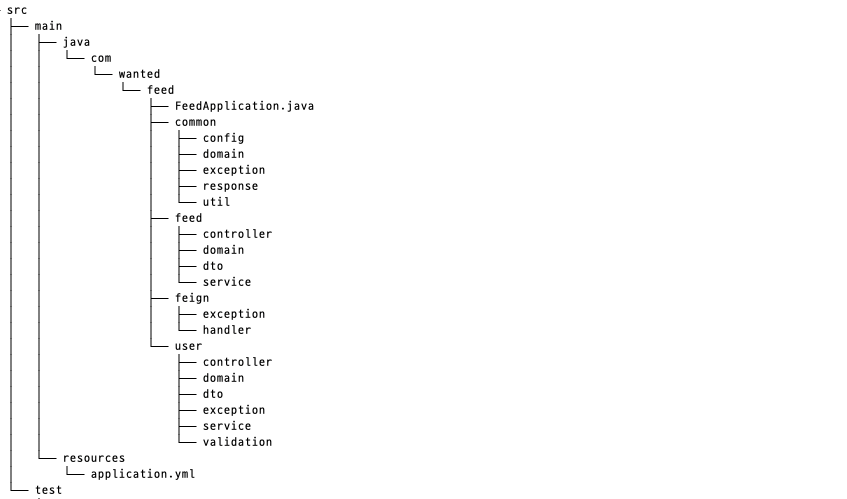

# 소셜 미디어 통합 Feed 서비스

## 📌 프로젝트 개요

본 서비스는 유저 계정의 해시태그(”#username”) 를 기반으로 인스타그램, 스레드, 페이스북, 트위터 등 복수의 SNS에 게시된 시물 중 유저의 해시태그가 포함된 게시물들을 하나의 서비스에서 확인할 수 있는 통합 Feed 어플리케이션 입니다.
이를 통해 본 서비스의 고객은 하나의 채널로 유저(”#username”) 또는 브랜드(”#wanted”) 의 SNS 노출 게시물 및 통계를 확인할 수 있습니다.


## 📌 기술 스택

### 개발환경
```
• IDE : IntelliJ IDEA Ultimate
• 언어 : Java 17
• 프레임워크 : Spring Boot 3.1.5
• 빌드 도구 : Gradle
• 데이터베이스 : MySQL 8.0
```
### 사용기술 & 협업도구
</a>
</a>
</a>
</a>
</a>
</a>
</a>
</a>
</a>
</a>
</a>
</a>

### 애플리케이션 실행 방법

```
1. Docker 컨테이너 실행
Docker를 사용하여 애플리케이션을 실행합니다.
docker-compose up -d

2. JAR 파일 생성
프로젝트의 JAR 파일을 생성합니다.

./gradlew bootJar
위 명령어는 애플리케이션의 빌드와 JAR 파일 생성을 수행합니다.

3. JAR 파일 실행
이제 생성된 JAR 파일을 실행하여 애플리케이션을 시작합니다.

java -jar ./build/libs/*.jar
애플리케이션이 성공적으로 실행되면 브라우저나 API 클라이언트를 통해 애플리케이션에 접근할 수 있습니다.
```
주의사항 
- 프로젝트 실행 전에 Docker 및 Java 개발 환경이 설치되어 있어야 합니다.
- 만약 포트 번호가 충돌하는 경우 Docker 컨테이너 또는 애플리케이션의 설정을 조정하세요.

## 📌 프로젝트 구조




## 📌 Feature


## 📌 ERD


## 📌 API
### [API 명세](https://github.com/wanted-pre-onboarding-backend-team-s/social-media-integrated-feed-service/wiki/API-%EB%AA%85%EC%84%B8)

### User(사용자)

|         Action     | Verbs  | URL Pattern  |
| :------------------| :----: | :----------: |
|        회원가임       |  POST   |    /join      |
|        가입승인       |  PATCH  |    /join      |
|        로그인        |  POST   |    /login     |

### Feed(피드)

|         Action     | Verbs  | URL Pattern  |
| :------------------| :----: | :----------: |
|        피드 목록 조회      |  GET   |    /feeds     |
|        피드 상세 조회      |  GET   |    /feeds/detail/{id}     |
|        피드 좋아요        |  POST   |    /feeds/{id}/likes    |
|        피드 공유          |  POST   |    /feeds/{id}/shares    |

### Statistics(통계)

|         Action     | Verbs  | URL Pattern  |
| :------------------| :----: | :----------: |
|        통계      |  GET   |    /stats      |


## 📌 Convention

### Git Convention
